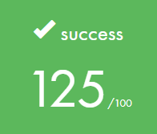
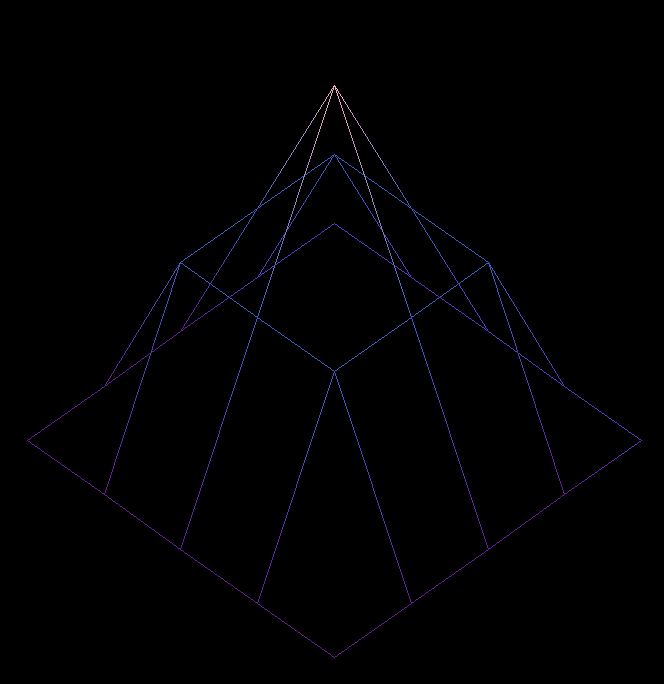
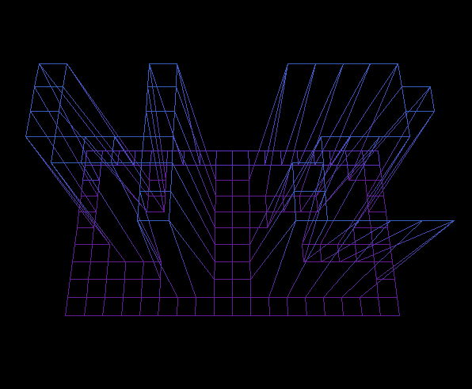
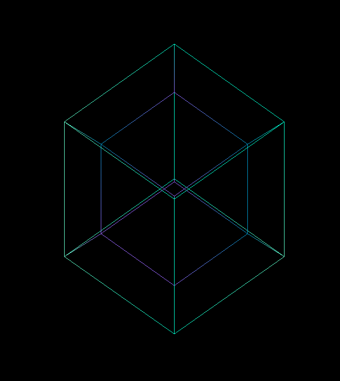
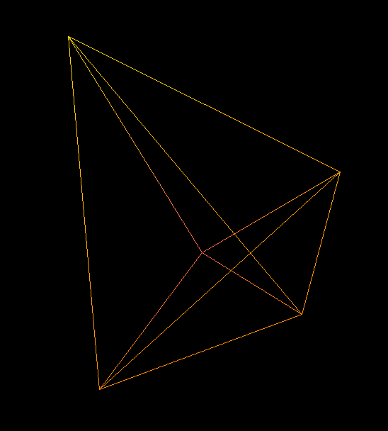
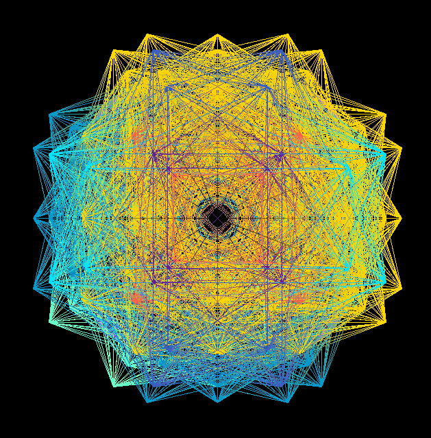

# FDF - Motor de Visualización Geométrica 3D/4D

> **Un motor de renderizado vectorial que transforma datos topográficos en visualizaciones 3D y explora la geometría 4D**

[](https://42.fr)
[](https://en.wikipedia.org/wiki/C_(programming_language))

---

## 🎯 ¿Qué es FDF?

FDF (FileDeFer) comenzó como un proyecto de 42 School para renderizar mapas topográficos en 3D. Mi implementación intenta ir un poco más allá: es un motor completo de transformaciones geométricas que explora tanto la visualización de datos del mundo real (3D) como la geometría de dimensiones superiores (4D).

### Características principales

- **Visualización topográfica**: Convierte datos de elevación en wireframes 3D interactivos
- **Geometría 4D**: Explora objetos imposibles de visualizar directamente (tesseract, pentachoron, hexacosicoron)
- **Múltiples proyecciones**: Isométrica, perspectiva, ortogonal
- **Rotaciones multidimensionales**: Controles intuitivos para navegar en 3D y 4D
- **Colorización automática**: Mapeo altura-color para mejor comprensión visual

<p align="center">  </p>

---

## 📊 De datos a visualización: El pipeline completo

### Paso 1: Interpretación de datos como vectores

Cada archivo `.fdf` contiene una matriz de elevaciones que interpreto como vectores posicionales:

```
Archivo de ejemplo una pirámide (42.fdf):
0 0 0 0 0
0 1 1 1 0
0 1 2 1 0
0 1 1 1 0
0 0 0 0 0

Se convierte en vectores 3D (X,Y,Z):
(0,0,0) (1,0,0) (2,0,0) (3,0,0) (4,0,0)
(0,1,0) (1,1,1) (2,1,1) (3,1,1) (4,1,0)
(0,2,0) (1,2,1) (2,2,2) (3,2,1) (4,2,0)
(0,3,0) (1,3,1) (2,3,1) (3,3,1) (4,3,0)
(0,4,0) (1,4,0) (2,4,0) (3,4,0) (4,4,0)

Formarían una figura parecida a esto:
```
 </p>

**Regla de conversión:**
- `x = columna` en el archivo
- `y = fila` en el archivo
- `z = valor` de elevación

Esto crea una malla de puntos donde cada coordenada representa tanto una posición como un vector desde el origen.

## 🌀 Paso 2: Rotar los puntos

En la imagen adjunta los puntos están rotados. Si simplemente proyectáramos los puntos `(x, y, z)` como `(x, y)`, obtendríamos una **vista aérea plana**.

Para crear la **ilusión de profundidad** o tridimensionalidad, necesitamos **rotar los puntos** como vectores antes de proyectarlos. Esto transforma cómo se dibujan en pantalla y nos da una sensación visual parecida a una perspectiva en 3D.

### Transformaciones geométricas

Un vector en 2D es una flecha que va desde un punto de origen (normalmente el (0,0)) hasta un punto en el plano (x, y). Representa tanto una posición como una dirección y magnitud.

### 🔢 Qué es una coordenada?

Es importante entender que una coordenada o un par ordenado puede representarse como un número complejo que tiene una parte real (x) y una parte imaginaria (y). Esto es muy importante si queremos entender a profundidad toda la matemática que hay detrás, es por ello que recomiendo mucho que veas estos dos videos antes y luego regreses a esta demostración para el proyecto FDF.

Parte1: https://www.youtube.com/watch?v=5FemcGdN3Xw

Parte2: https://www.youtube.com/watch?v=f7iOdIaourk

#### 🔄 Las rotaciones como transformaciones lineales

Una rotación en 2D es la transformación más fundamental.
Para rotar un vector `v = (x,y)` por un ángulo θ:

**Demostración paso a paso:**

Primero, expresemos el vector en coordenadas polares:
```
x = r·cos(α)
y = r·sin(α)
```

- `r` es la distancia desde el origen (la magnitud del vector) || r = √(x² + y²) por pitagoras
- `α` es el ángulo original del vector respecto al eje x || α = atan2(y, x)

Al rotarlo por un nuevo ángulo `θ`, el vector pasa a tener una orientación `α + θ`:
```
x' = r·cos(α + θ)
y' = r·sin(α + θ)
```

**¡Aquí está el problema!** Necesitamos las identidades trigonométricas:
```
cos(α + θ) = cos(α)cos(θ) - sin(α)sin(θ)
sin(α + θ) = sin(α)cos(θ) + cos(α)sin(θ)
```

Pero **¿de dónde vienen estas fórmulas?** Para entenderlo completamente, necesitamos hacer un viaje por los fundamentos matemáticos.

## 💸 ¿Qué es `e`? El fundamento del crecimiento

Antes de entender las rotaciones complejas, conozcamos al número `e`.

El número e es irracional (e ≈ 2.718...). Mientras π aparece en círculos, **e aparece en todo lo que crece**: bacterias, intereses bancarios, redes neuronales, incluso en física cuántica.

### 🏦 El experimento del banco infinito

Imagina que metes 1 € en el banco y el interés es del 100% anual:

```
Si pagan 1 vez al año:     1 € × (1 + 1) = 2.00 €
Si pagan 2 veces al año:   1 € × (1 + 0.5)² = 2.25 €
Si pagan 4 veces al año:   1 € × (1 + 0.25)⁴ = 2.44 €
Si pagan 12 veces al año:  1 € × (1 + 1/12)¹² = 2.61 €
Si pagan infinitas veces:  1 € × lim(n→∞)(1 + 1/n)ⁿ = 2.718... €
```

Ese límite mágico es **e**:
```
e = lim (n → ∞) (1 + 1/n)^n
```

## 🌀 Los números complejos: El giro hacia lo imaginario

### ❓ ¿Qué es la unidad imaginaria i?

Los números imaginarios surgen cuando intentamos resolver y² = -1. En números reales es imposible, pero i nos lo permite:

```
i = √(-1)
i² = -1
```

**Desde el punto de vista geométrico**, multiplicar por i es rotar 90°:
```
i⁰ = 1        (0° - punto de partida)
i¹ = i        (90° - un cuarto de vuelta)
i² = -1       (180° - media vuelta)
i³ = -i       (270° - tres cuartos de vuelta)
i⁴ = 1        (360° - vuelta completa)
```

### 🌪️ La identidad de Euler: El crecimiento que gira

Estos cambios de los números imaginarios los podemos explicar con la identidad de Euler. Pero primero, conectemos las ideas:

**Lo que sabemos hasta ahora:**
- **e** representa crecimiento continuo
- **i** representa rotación de 90°
- **i²** = -1 es una rotación de 180°

**La pregunta natural:** ¿Qué pasa cuando combinamos crecimiento (e) con rotación (i)?

#### 🧭 El patrón de las rotaciones

Observemos otra vez el comportamiento de i:
```
i⁰ = 1        (0° - punto de partida)
i¹ = i        (90° - giramos hacia "arriba")
i² = -1       (180° - giramos hacia la "izquierda")
i³ = -i       (270° - giramos hacia "abajo")
i⁴ = 1        (360° - volvemos al inicio)
```

**Cada potencia de i nos lleva a un punto específico en el círculo unitario.** ¿No te parece familiar? Son exactamente las coordenadas que nos darían cos y sin en esos ángulos:

```
cos(0°) + i·sin(0°) = 1 + i·0 = 1
cos(90°) + i·sin(90°) = 0 + i·1 = i
cos(180°) + i·sin(180°) = -1 + i·0 = -1
cos(270°) + i·sin(270°) = 0 + i·(-1) = -i
```

**🤔 ¿Esto es casualidad?**

Tenemos dos patrones que parecen describir exactamente lo mismo:
- **Las potencias de i:** i⁰, i¹, i², i³... nos dan puntos en el círculo
- **Las funciones trigonométricas:** cos(θ) + i·sin(θ) también nos dan puntos en el círculo

**Pero aquí está la conexión clave:** Sabemos que **e** representa crecimiento exponencial. ¿Qué pasaría si combináramos el crecimiento exponencial (e) con la rotación (i)?

Recordemos que **e^x** significa "multiplicar e por sí mismo x veces de manera continua". Entonces **e^(i·θ)** debería significar "aplicar la rotación i de manera continua θ radianes".

**🎯 La conexión:** Las potencias de **i** nos dan rotaciones discretas (90°, 180°, 270°...), pero **e^(i·θ)** nos da rotación continua para cualquier ángulo θ.

Si **e^(algo)** siempre representa "multiplicación repetida", entonces **e^(i·θ)** debería representar "rotación repetida" θ radianes.

#### ⚡ El momento de revelación

**¿Coincidencia?** ¡Para nada! Lo que estamos viendo es la identidad de Euler:

```
e^(iθ) = cos(θ) + i·sin(θ)
```

**¿Por qué tiene sentido esta fórmula?**
- **e^(algo)** siempre representa algún tipo de "crecimiento" o "multiplicación"
- **i·θ** significa "rotar θ radianes"
- **cos(θ) + i·sin(θ)** son las coordenadas exactas del punto en el círculo después de rotar θ. Donde el cos es la parte real y el sen es la parte imaginaria.

**Verificación directa:**
```
e^(i·0) = cos(0) + i·sin(0) = 1 + 0i = 1 ✓
e^(i·π/2) = cos(π/2) + i·sin(π/2) = 0 + i = i ✓
e^(i·π) = cos(π) + i·sin(π) = -1 + 0i = -1 ✓
```

#### 💎 Curiosidad: ¿Por qué es la fórmula más hermosa de las matemáticas?

**La identidad más famosa:** Cuando θ = π (180°):
```
e^(iπ) = cos(π) + i·sin(π) = -1 + 0i = -1
```

**Reorganizando:** e^(iπ) + 1 = 0

Esta ecuación conecta cinco constantes fundamentales (e, i, π, 1, 0) y es considerada una de las más bellas de las matemáticas.

**Resumen visual:**
```
e^(i·0) = 1        (no giramos, seguimos en (1,0))
e^(i·π/2) = i      (giramos 90°, vamos a (0,1))
e^(i·π) = -1       (giramos 180°, vamos a (-1,0))
e^(i·2π) = 1       (giramos 360°, volvemos a (1,0))
```

**La clave:** e^(iθ) = cos(θ) + i·sin(θ) nos da exactamente el punto correcto en el círculo para cualquier ángulo θ.

#### 🎯 La fórmula emerge

Si observas estos ejemplos, verás que cada punto al que llegamos se puede escribir como:
- Las coordenadas (x, y) del punto final
- O sea: x + iy

Para cualquier ángulo θ:
- **x = cos(θ)** (coordenada real horizontal donde terminamos)
- **y = sin(θ)** (coordenada imganaria vertical donde terminamos)

Por tanto: **e^(iθ) = cos(θ) + i·sin(θ)**

#### 🔍 Al fin con esto ya podemos obtener las identidades trigonométricas

Ahora que sabemos que **e^(iθ) = cos(θ) + i·sin(θ)**, podemos usarlo para derivar las famosas identidades de suma de ángulos que necesitamos.

**Como lo haremos, haciendo esta pregunta clave:** ¿Qué pasa si tengo dos rotaciones seguidas?

Si roto primero α y luego θ, es lo mismo que rotar (α + θ) de una vez:
```
e^(iα) × e^(iθ) = e^(i(α + θ))
```

**Lado izquierdo** (dos rotaciones por separado):
```
e^(iα) × e^(iθ) = (cos(α) + i·sin(α)) × (cos(θ) + i·sin(θ))
```

Expandiendo esta multiplicación:
```
= cos(α)cos(θ) + cos(α)·i·sin(θ) + i·sin(α)cos(θ) + i·sin(α)·i·sin(θ)
= cos(α)cos(θ) + i·cos(α)sin(θ) + i·sin(α)cos(θ) + i²·sin(α)sin(θ)
```

Como i² = -1:
```
= cos(α)cos(θ) - sin(α)sin(θ) + i(cos(α)sin(θ) + sin(α)cos(θ))
```

**Lado derecho** (una rotación total):
```
e^(i(α + θ)) = cos(α + θ) + i·sin(α + θ)
```

**¡Igualando ambos lados!**
```
cos(α + θ) + i·sin(α + θ) = [cos(α)cos(θ) - sin(α)sin(θ)] + i[cos(α)sin(θ) + sin(α)cos(θ)]
```

Para que dos números complejos sean iguales, sus partes reales e imaginarias deben ser iguales:

**Parte real:**
```
cos(α + θ) = cos(α)cos(θ) - sin(α)sin(θ)
```

**Parte imaginaria:**
```
sin(α + θ) = sin(α)cos(θ) + cos(α)sin(θ)
```

**¡BRUTAL! 💥** Estas son exactamente las identidades trigonométricas que necesitábamos y que habiamos mencionado al inicio.

## 🔄 Completando el círculo: Las fórmulas de rotación

**Ahora podemos terminar lo que empezamos:**

Teníamos:
```
x' = r·cos(α + θ)
y' = r·sin(α + θ)
```

Aplicando nuestras identidades recién derivadas:
```
x' = r·[cos(α)cos(θ) - sin(α)sin(θ)]
y' = r·[sin(α)cos(θ) + cos(α)sin(θ)]
```

Como el punto original era (x, y) = (r·cos(α), r·sin(α)):
```
x' = x·cos(θ) - y·sin(θ)
y' = x·sin(θ) + y·cos(θ)
```

**💻 Implementación en código:**

En nuestro código luce de esta manera:

```c
void rotate_2d(float *x, float *y, float angle)
{
    float prev_x = *x;
    float prev_y = *y;

    *x = prev_x * cos(angle) - prev_y * sin(angle);
    *y = prev_x * sin(angle) + prev_y * cos(angle);
}
```

#### 🧊 Extensión a 3D: Rotaciones por planos

En 3D, las rotaciones ocurren en planos, no alrededor de ejes. Cada rotación 3D es una rotación 2D en un plano específico.

**¿Por qué decimos "rotar alrededor del eje X"?**

Cuando decimos "rotar alrededor del eje X", realmente queremos decir "rotar en el plano perpendicular al eje X". El eje X se mantiene fijo, y los otros dos ejes (Y y Z) forman el plano de rotación.

```c
// Rotación "alrededor del eje X" = rotación en el plano YZ
void rotate_x(float *y, float *z, float angle)
{
    float prev_y = *y;
    float prev_z = *z;

    *y = prev_y * cos(angle) - prev_z * sin(angle);
    *z = prev_y * sin(angle) + prev_z * cos(angle);
    // x no cambia - es perpendicular al plano YZ
}
```

**¿Por qué funcionan estas fórmulas exactas?**

Si imaginamos mirar desde el eje X hacia el origen, vemos el plano YZ como un plano 2D normal:

```
Vista desde +X mirando hacia el origen:
     Z↑
     |
     |
     •———→ Y
```

En esta vista, Y actúa como el "eje X del plano" y Z actúa como el "eje Y del plano". Por eso usamos exactamente las mismas fórmulas de rotación 2D que derivamos antes.

#### ⚠️ ¡Cuidado con la orientación de los ejes!

**Aquí viene lo importante:** Los signos en las fórmulas cambian según qué plano estamos rotando. ¿Por qué?

**La clave:** Cada rotación es básicamente una rotación 2D en un plano específico, pero la orientación de los ejes en ese plano determina los signos.

**Piénsalo así:**
- Rotación X: Rotas en el plano YZ → Los ejes Y y Z se comportan como X e Y en 2D normal
- Rotación Y: Rotas en el plano XZ → Pero ahora X y Z no están en la misma orientación que X e Y
- Rotación Z: Rotas en el plano XY → Vuelve a ser como 2D normal

```c
// Rotación alrededor de X (en plano YZ)
*y = prev_y * cos(angle) - prev_z * sin(angle);
*z = prev_y * sin(angle) + prev_z * cos(angle);

// Rotación alrededor de Y (en plano XZ)
*x = prev_x * cos(angle) + prev_z * sin(angle);  // ¡SIGNO CAMBIADO!
*z = -prev_x * sin(angle) + prev_z * cos(angle); // ¡SIGNO CAMBIADO!

// Rotación alrededor de Z (en plano XY)
*x = prev_x * cos(angle) - prev_y * sin(angle);
*y = prev_x * sin(angle) + prev_y * cos(angle);
```

**¿Por qué estos cambios de signo?**

Todo depende de si estamos mirando el plano desde el lado "positivo" o "negativo" del eje:

1. **Rotar alrededor de X:** Miramos desde +X hacia el origen
   - Y→, Z↑
   - Rotación positiva va de Y hacia Z (antihorario)
   - Fórmulas normales: `y' = y·cos - z·sin, z' = y·sin + z·cos`

2. **Rotar alrededor de Y:** Miramos desde +Y hacia el origen
   - X←, Z↑
   - Esta diferente orientación de los ejes requiere ajustar los signos en las fórmulas
   - Para que queden como X↑, Z→

3. **Rotar alrededor de Z:** Miramos desde +Z hacia el origen
   - X→, Y↑
   - Es como el caso normal 2D


#### 👽 El salto a 4D: Más simple de lo que parece

En 4D seguimos usando las mismas fórmulas de rotación 2D, solo que ahora tenemos más planos donde rotar. Son independientes entre sí y no se generan ejes perpendiculares por lo que es siempre la misma fórmula sin cambios de signo, paradójicamente más sencillo que en 3D.

💡 **¡Es la misma fórmula que en 2D!** Solo cambiamos qué coordenadas usamos.

```c
// Rotar en el plano XW (usando la 4ª dimensión)
void rotate_xw(float *x, float *w, float angle)
{
    float prev_x = *x;
    float prev_w = *w;

    *x = prev_x * cos(angle) - prev_w * sin(angle);
    *w = prev_x * sin(angle) + prev_w * cos(angle);
    // y, z NO cambian - no están en este plano
}
```

### 📐 Paso 3: Proyecciones - Reduciendo dimensiones

#### 🔮 Proyección 4D → 3D: Como hacer una "sombra" dimensional

**En realidad es simple:** Imagina que tienes una linterna y quieres ver la "sombra" de un objeto 4D en nuestro mundo 3D.

**Analogía fácil:**
```
Linterna → Objeto → Pared = Sombra
         → 3D     → 2D    = Sombra 2D (lo que vemos normalmente)
         → 4D     → 3D    = "Sombra" 3D (lo que necesitamos)
```

**¿Cómo funciona?**
- Esta sombra distorsiona las relaciones y distancia, no es lo más fiel a la realidad pero nos permite verla en 3D
- Los puntos más "cerca" en la 4ª dimensión (W pequeña) se ven más grandes
- Los puntos más "lejos" en la 4ª dimensión (W grande) se ven más pequeños
- Es el mismo concepto de la perspectiva que luego aplicamos en nuestros otros tipos de proyección.

**La fórmula de proyección**
```
Para proyectarlo debemos influir a cada uno de los otros valores de las coordenadas con este principio de perspectiva a través de este factor:
factor = distancia_observador / (distancia_observador - w)

punto_3d = (x·factor, y·factor, z·factor)
```

**En código:**
```c
void project_4d_to_3d(t_point *point, float distance)
{
    float factor = distance / (distance - point->w);

    point->x *= factor;  // Ajustar X según la "distancia 4D"
    point->y *= factor;  // Ajustar Y según la "distancia 4D"
    point->z *= factor;  // Ajustar Z según la "distancia 4D"
    // w se descarta - ya no lo necesitamos
}
```

#### 📊 Proyección 3D → 2D: Múltiples sistemas

**📐 1. Proyección Isométrica**

La proyección isométrica es como hacer varias rotaciones 3D seguidas, pero "pre-calculadas" en una fórmula:

```c
// El ángulo específico: 0.6154797f ≈ 35.26° (radianes)
float iso_angle = 0.6154797f;

iso_x = (x - y) * cos(iso_angle);  // ≈ 0.816
iso_y = (x + y) * sin(iso_angle) - z;  // ≈ 0.577
```

**¿De dónde sale ese ángulo?**

Este ángulo `0.6154797` radianes (≈35.26°) viene de la combinación de dos rotaciones:

1. **Rotación de 45° alrededor del eje Z** (para que X e Y se vean iguales)
2. **Rotación de ~35.26° alrededor del eje X** (para que Z también se vea igual)

**¿Por qué este ángulo específico?**

Este ángulo hace que los tres ejes X, Y, Z se vean exactamente iguales en longitud cuando se proyectan al plano 2D. Es el único ángulo que logra esto por eso se le llama isometría.

**👁️ 2. Proyección Perspectiva (POV)**

Esta es la proyección más realista - simula exactamente cómo vemos las cosas en la vida real y funciona igual a la sombra de la cuarta dimensión:

```c
distance = 500.0f;  // Distancia del "observador"
factor = distance / (-point->z + distance);
point->x = point->x * factor;
point->y = point->y * factor;
```

**¿Cómo funciona?**
- Los objetos **más cerca** (Z negativa) se ven **más grandes**
- Los objetos **más lejos** (Z positiva) se ven **más pequeños**
- Crea la ilusión de **profundidad real**

**Analogía:** Es como mirar por una ventana - los coches lejanos se ven pequeños, los cercanos se ven grandes.


i
**📏 3. Proyecciones Ortogonales**

Son las más simples - eliminan directamente una dimensión, como "aplastar" el objeto.

| Tecla | Proyección   | Qué elimina       | Qué conserva | Para qué sirve            |
|-------|--------------|-------------------|--------------|---------------------------|
| `T`   | **Top**      | Z (altura)        | X, Y         | Mapas, vista desde arriba |
| `F`   | **Front**    | Y (profundidad)   | X, Z         | Alzados, vista frontal    |
| `L`   | **Lateral**  | X (anchura)       | Z, Y         | Perfiles, vista de lado   |

## 🔮 Explorando la geometría 4D

### ❓ ¿Qué significa "4D"?

```
1D: Una línea
•————————•

2D: Un cuadrado
•————————•
|        |
|        |
•————————•

3D: Un cubo
    •————————•
   /|       /|
  / |      / |
 •————————•  |
 |  •—————|——•
 | /      | /
 |/       |/
 •————————•

4D: Un tesseract
(Imposible de dibujar directamente solo a través de una sombra)
```

### 🎲 Objetos 4D implementados

| Objeto | Vértices | Descripción | Analogía |
|--------|----------|-------------|----------|
| **Tesseract** | 16 | Hipercubo 4D | Como un cubo, pero con una dimensión extra |
| **Pentachoron** | 5 | Simplejo 4D | El análogo 4D de un triángulo/tetraedro |
| **Hexacosicoron** | 120 | Polítopo complejo | Una "esfera" hecha de 600 tetraedros |

#### 🎲 Tesseract (Hipercubo 4D)



**🔍 ¿Qué es?**
Un tesseract es la versión 4D de un cubo. Mientras un cubo tiene 8 vértices, el tesseract tiene 16.

**🏗️ ¿Cómo se construye?**
Igual que un cubo se forma tomando dos cuadrados y conectándolos, un tesseract se forma tomando dos cubos y conectando sus vértices correspondientes:

```c
// Cubo 1: W = -1 (el cubo "de atrás" en la 4ª dimensión)
{-1,-1,-1,-1}, {1,-1,-1,-1}, {1,1,-1,-1}, {-1,1,-1,-1},
{-1,-1,1,-1},  {1,-1,1,-1},  {1,1,1,-1},  {-1,1,1,-1},

// Cubo 2: W = +1 (el cubo "de adelante" en la 4ª dimensión)
{-1,-1,-1,1},  {1,-1,-1,1},  {1,1,-1,1},  {-1,1,-1,1},
{-1,-1,1,1},   {1,-1,1,1},   {1,1,1,1},   {-1,1,1,1}
```

**👀 ¿Qué vemos al rotarlo?**
- Al rotar en planos XW o YW: El tesseract parece "respirar" - se contrae y expande
- Al rotar en planos XY o ZW: Los cubos internos se tuercen y deforman
- **Efecto visual:** Como si fuera un cubo que se estira hacia una dimensión invisible

#### 🔺 Pentachoron



**🔍 ¿Qué es?**
El polítopo 4D más simple, como un tetraedro pero en 4 dimensiones. Tiene 5 vértices (de ahí "penta").

**⭐ Estructura:**
```c
// 5 vértices que forman el simplejo 4D más básico
{1,1,1,1}, {1,-1,-1,1}, {-1,1,-1,1}, {-1,-1,1,1}, {0,0,0,-1}
```

**👀 ¿Qué vemos al rotarlo?**
- Al rotar: Parece que los vértices "saltan" entre posiciones
- Las líneas se cruzan de formas imposibles en 3D
- **Efecto visual:** Como una red que se retuerce en patrones hipnóticos

#### ⚪ Hexacosicoron (600-cell)



**¿Qué es?**
Un polítopo 4D extremadamente complejo con 120 vértices y 600 tetraedros como caras.

**⭐ Estructura:**
- 120 vértices dispuestos simétricamente
- Se aproxima a una "hiperesfera" en 4D
- Es el análogo 4D de un icosaedro

**👀 ¿Qué vemos al rotarlo?**
- **Densidad visual impresionante:** 600 tetraedros creando patrones complejos
- Al rotar: Parece una "medusa" de luz que pulsa y se deforma
- **Efecto visual:** Como galaxias de puntos que danzan en formaciones imposibles

### 🌀 El poder de las rotaciones 4D

**¿Por qué rotar en 4D es tan revelador?**

Cuando rotamos objetos 4D, vemos aspectos que son imposibles de percibir desde una perspectiva fija:

```c
rotate_xy(&point.x, &point.y, cam.delta);
rotate_xw(&point.x, &point.w, cam.epsilon);
rotate_yw(&point.y, &point.w, cam.theta);
rotate_zw(&point.z, &point.w, cam.iota);
```

**Efectos visuales que vemos:**

1. **"Breathing" (Respiración):** El objeto parece hincharse y contraerse
2. **"Inside-out" (Vuelta del revés):** Partes internas salen afuera
3. **"Impossible connections":** Líneas que se conectan de formas imposibles en 3D
4. **"Morphing":** El objeto cambia de forma completamente

**¿Por qué es importante?**
- Nos ayuda a **intuir** la geometría 4D
- Revela **simetrías ocultas** que no vemos en una vista estática
- Es como ver un objeto 3D desde todos los ángulos a la vez, pero en 4D

---

## 🎨 El motor de renderizado

```c
void	render_3d_map(t_fdf *data, t_map *map, int error)
{
	int			x;
	int			y;
	t_point		a;
	t_point		b;

	y = -1;
	while (++y < map->height)
	{
		x = -1;
		while (++x < map->width)
		{
			a = project_point(map->points[y][x], data->map, data->cam);
			if (x + 1 < map->width - error)
			{
				b = project_point(map->points[y][x + 1], data->map, data->cam);
				draw_line(a, b, data);
			}
			if (y + 1 < map->height && x < map->width - error)
			{
				b = project_point(map->points[y + 1][x], data->map, data->cam);
				draw_line(a, b, data);
			}
		}
	}
}
```

### ➡️ Algoritmo para dibujar las líneas

Para conectar dos puntos proyectados, uso una versión optimizada del algoritmo de Bresenham con interpolación de colores:

```c
void	draw_line(t_point p1, t_point p2, t_fdf *data)
{
	t_point_2d	a;
	t_point_2d	b;
	t_line		line;

	if (!is_on_screen(p1.x, p1.y) && !is_on_screen(p2.x, p2.y))
		return ;
	conv_point_to_int(&a, &b, p1, p2);
	init_line(&line, a, b);
	while (TRUE)
	{
		line.mix_c = interpolate_color(line.c1, line.c2, line.t / line.steps);
		ft_mlx_put_pixel(data, a.x, a.y, line.mix_c);
		if (a.x == b.x && a.y == b.y)
			break ;
		line.double_error = 2 * line.error;
		if (line.double_error > -line.dy)
		{
			line.error = line.error - line.dy;
			a.x += line.sx;
		}
		if (line.double_error < line.dx)
		{
			line.error = line.error + line.dx;
			a.y += line.sy;
		}
		line.t++;
	}
}
```

### 🎨 Mapeo automático de colores

Para visualizar elevaciones, mapeo automáticamente alturas a colores:

```c
int	interpolate_color(int color1, int color2, float t)
{
	t_color	c;

	c.r1 = (color1 >> 16) & 0xFF;
	c.g1 = (color1 >> 8) & 0xFF;
	c.b1 = (color1) & 0xFF;
	c.r2 = (color2 >> 16) & 0xFF;
	c.g2 = (color2 >> 8) & 0xFF;
	c.b2 = (color2) & 0xFF;
	c.r = c.r1 + (int)((c.r2 - c.r1) * t);
	c.g = c.g1 + (int)((c.g2 - c.g1) * t);
	c.b = c.b1 + (int)((c.b2 - c.b1) * t);
	return ((c.r << 16) | (c.g << 8) | c.b);
}
```

### ⚙️ El pipeline de proyecciones y rotaciones

```c
t_point	project_point(t_point point, t_map map, t_cam cam)
{
	if (map.type == OBJECT_4D)
	{
		rotate_xy(&point.x, &point.y, cam.delta);
		rotate_xw(&point.x, &point.w, cam.epsilon);
		rotate_yw(&point.y, &point.w, cam.theta);
		rotate_zw(&point.z, &point.w, cam.iota);
		project_4d_to_3d(&point);
	}
	point.x = point.x * cam.zoom;
	point.y = point.y * cam.zoom;
	point.z = point.z * cam.zoom;
	if (map.type == OBJECT_3D)
		move_map_to_origin(&point, map, cam);
	rotate_x(&point.y, &point.z, cam.alpha);
	rotate_y(&point.x, &point.z, cam.beta);
	rotate_z(&point.x, &point.y, cam.gamma);
	project_3d_to_2d(&point, cam.projection);
	point.x = point.x + cam.x_offset;
	point.y = point.y + cam.y_offset;
	return (point);
}
```

---

## 🚀 Instalación y uso

### 🔧 Compilación

```bash
git clone https://github.com/LordMikkel/Fdf.git
cd fdf
make
```

### 🎮 Ejemplos de uso

```bash
# Mapas topográficos
./fdf maps/42.fdf							# Logo de 42 School
./fdf maps/julia.fdf						# Conjunto de Julia (fractal)
./fdf maps/pyramide.fdf						# Pirámide simple
./fdf maps/sagrada_familia_detailed.fdf		# Mapa customizado simulando la sagrada familia

# Objetos 4D
./fdf tesseract            # Hipercubo 4D
./fdf pentachoron         # Simplejo 4D
./fdf hexacosicoron       # Polítopo complejo
```

### 🎯 Controles interactivos

**🎮 Navegación 3D:**
- `↑↓←→`: Rotación pitch/yaw
- `< >`: Rotación roll
- `Mouse drag`: Translación libre
- `Mouse wheel`: Zoom

**🌌 Navegación 4D:**
- `W/S`: Rotación planos XY + ZW
- `A/D`: Rotación planos XZ + YW
- `Q/E`: Rotación planos YZ + XW

**📐 Proyecciones:**
- `I`: Isométrica
- `P`: Perspectiva
- `T`: Vista superior
- `F`: Vista frontal
- `L`: Vista lateral

---

## 🎯 Conclusión

FDF comenzó como un proyecto de visualización de mapas topográficos y evolucionó hacia una exploración profunda de la geometría multidimensional. A través de la implementación de transformaciones vectoriales, proyecciones y algoritmos de renderizado, no solo sirvió para crear una herramienta funcional, sino que desarrollé una comprensión intuitiva de conceptos matemáticos fundamentales.

El proyecto demuestra que las matemáticas complejas se vuelven accesibles cuando se construyen paso a paso desde principios básicos, y que la visualización es una herramienta poderosa para entender abstracciones que desafían la intuición.

---

## ✍️ Crédito

Soy Mikel Garrido, estudiante de 42 Barcelona. Siempre intento hacer la implementación más simple pero a la vez más robusta en todos mis proyectos. Espero poder ayudarte con esta guía.

[](https://profile.intra.42.fr/users/migarrid)

