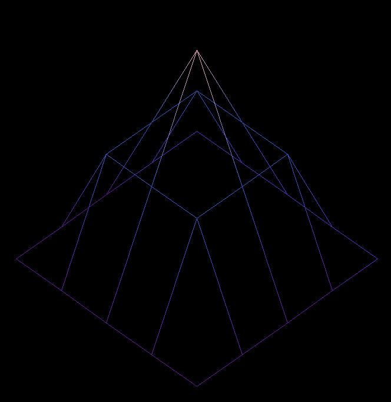
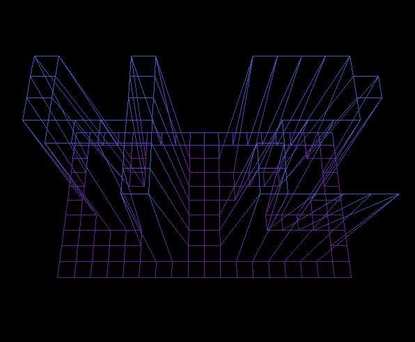

# FDF - 3D/4D Geometric Visualization Engine

> **A vectorial rendering engine that transforms topographic data into 3D visualizations and explores 4D geometry**

[](https://42.fr)
[](https://en.wikipedia.org/wiki/C_(programming_language))

<p align="center"><a href="./README.md">🇪🇸 Versión en español</a></p>

<p align="center">
  
</p>

<p align="center">
  <a href="https://youtube.com/shorts/mFSVPARuHaU" target="_blank" rel="noopener noreferrer">
    Original + Interstellar epic music
  </a>
</p>

---

## 📋 Table of Contents

- [🎯 What is FDF?](#-what-is-fdf)
- [📊 From data to visualization: The complete pipeline](#-from-data-to-visualization-the-complete-pipeline)
  - [📊 Step 1: Data interpretation as vectors](#step-1-data-interpretation-as-vectors)
  - [🌀 Step 2: Rotating the points](#-step-2-rotating-the-points)
  - [📐 Step 3: Projections - Reducing dimensions](#-step-3-projections---reducing-dimensions)
- [🔮 Exploring 4D geometry](#-exploring-4d-geometry)
- [🎨 The rendering engine](#-the-rendering-engine)
- [🚀 Installation and usage](#-installation-and-usage)
- [🎯 Conclusion](#-conclusion)
- [✍️ Credits](#️-credits)

---

## 🎯 What is FDF?

FDF (FileDeFer) started as a 42 School project to render topographic maps in 3D. My implementation goes a bit further: it's a complete geometric transformation engine that explores both real-world data visualization (3D) and higher-dimensional geometry (4D).

### Key Features

- **Topographic visualization**: Converts coordinate data from a map into 3D wireframes
- **4D geometry**: Explores objects impossible to visualize directly (tesseract, pentachoron, hexacosicoron)
- **Multiple projections**: Isometric, perspective, orthogonal
- **Multidimensional rotations**: Intuitive controls to navigate in 3D and 4D
- **Automatic colorization**: Height-to-color mapping for better visual understanding

<p align="center">  </p>

---

## 📊 From data to visualization: The complete pipeline

## Step 1: Data interpretation as vectors

Each `.fdf` file works as a map containing an elevation matrix that I interpret as positional vectors:

```
Example file: pyramid (42.fdf):
0 0 0 0 0
0 1 1 1 0
0 1 2 1 0
0 1 1 1 0
0 0 0 0 0

Converts to 3D vectors (X,Y,Z):
(0,0,0) (1,0,0) (2,0,0) (3,0,0) (4,0,0)
(0,1,0) (1,1,1) (2,1,1) (3,1,1) (4,1,0)
(0,2,0) (1,2,1) (2,2,2) (3,2,1) (4,2,0)
(0,3,0) (1,3,1) (2,3,1) (3,3,1) (4,3,0)
(0,4,0) (1,4,0) (2,4,0) (3,4,0) (4,4,0)

Would form a figure like this:
```


**Conversion rule:**
- `x = column` in the file
- `y = row` in the file
- `z = elevation` value

This creates a mesh of points where each coordinate represents both a position and a vector from the origin.

## 🌀 Step 2: Rotating the points

In the attached image, the points are rotated. If we simply projected the points `(x, y, z)` as `(x, y)`, we would get a **flat aerial view**.

To create the **illusion of depth** or three-dimensionality, we need to **rotate the points** as vectors before projecting them. This transforms how they're drawn on screen and gives us a visual sensation similar to a 3D perspective.

### Geometric transformations

We must start with the fact that a vector in 2D is an arrow that goes from an origin point (usually (0,0)) to a point in the plane (x, y). It represents both a position and a direction with magnitude.

### 🔢 What is a coordinate?

It's important to understand that a coordinate or ordered pair can be represented as a complex number that has a real part (x) and an imaginary part (y). This is very important if we want to understand in depth all the mathematics behind it, which is why I highly recommend watching these two videos first and then returning to this demonstration for the FDF project.

**Part 1: https://www.youtube.com/watch?v=5FemcGdN3Xw**

**Part 2: https://www.youtube.com/watch?v=f7iOdIaourk**

#### 🔄 Rotations as linear transformations

A 2D rotation is the most fundamental transformation.
To rotate a vector `v = (x,y)` by an angle θ:

**Step-by-step demonstration:**

First, let's express the vector in polar coordinates:
```
x = r·cos(α)
y = r·sin(α)
```

- `r` is the distance from the origin (the vector's magnitude) || r = √(x² + y²) by Pythagoras
- `α` is the original angle of the vector with respect to the x-axis || α = atan2(y, x)
- `cos` and `sin` are functions that allow us to **decompose a vector into its X and Y components**. Think of it as a triangle: cosine gives us the horizontal component (X) and sine gives us the vertical component (Y) of the vector. 📐 [This video will help you visualize it graphically](https://www.youtube.com/shorts/aTEyA82u52k)

When rotating it by a new angle `θ`, the vector gets an orientation `α + θ`:
```
x' = r·cos(α + θ)
y' = r·sin(α + θ)
```

To continue with the process, we need the **trigonometric identities:**
```
cos(α + θ) = cos(α)cos(θ) - sin(α)sin(θ)
sin(α + θ) = sin(α)cos(θ) + cos(α)sin(θ)
```

But **where do these formulas come from?** To understand it completely, we need to grasp some mathematical fundamentals.

### 💸 What is `e`? The foundation of growth

The number e is irrational (e ≈ 2.718...). While π appears in circles, **e appears in everything that grows**: bacteria, bank interest, neural networks, even quantum physics.

### 🏦 The infinite bank experiment

Imagine you put €1 in the bank and the interest is 100% annually:

```
If paid 1 time per year:     €1 × (1 + 1) = €2.00
If paid 2 times per year:    €1 × (1 + 0.5)² = €2.25
If paid 4 times per year:    €1 × (1 + 0.25)⁴ = €2.44
If paid 12 times per year:   €1 × (1 + 1/12)¹² = €2.61
If paid infinite times:      €1 × lim(n→∞)(1 + 1/n)ⁿ = €2.718...
```

That magical limit is **e**:
```
e = lim (n → ∞) (1 + 1/n)^n
```

### 🌀 Complex numbers: The turn towards the imaginary

### ❓ What is the imaginary unit i?

Imaginary numbers arise when we try to solve y² = -1. **Why is it impossible in real numbers?** Because any real number squared always gives a positive result or zero:

```
3² = 9 (positive)
(-3)² = 9 (also positive!)
0² = 0 (zero)
```

**There is no real number that multiplied by itself gives a negative result.** That's why we need to invent i:

```
i = √(-1)
i² = -1
```

💡 **If you want to know the origin of imaginary numbers** [you have to watch this video](https://www.youtube.com/watch?v=VN7nipynE0c)

**From a geometric point of view**, multiplying by i is rotating 90°:
```
i⁰ = 1        (0° - starting point)
i¹ = i        (90° - quarter turn)
i² = -1       (180° - half turn)
i³ = -i       (270° - three-quarter turn)
i⁴ = 1        (360° - full turn)
```

### 🌪️ Euler's identity: Growth that rotates

These changes in imaginary numbers can be explained with Euler's identity. But first, let's connect the ideas:

**What we know so far:**
- **e** represents continuous growth
- **i** represents 90° rotation
- **i²** = -1 is a 180° rotation

**The natural question:** What happens when we combine growth (e) with rotation (i)?

#### 🧭 The pattern of rotations

Let's observe the behavior of i again:
```
i⁰ = 1        (0° - starting point)
i¹ = i        (90° - we turn "up")
i² = -1       (180° - we turn to the "left")
i³ = -i       (270° - we turn "down")
i⁴ = 1        (360° - we return to the beginning)
```

**Each power of i takes us to a specific point on the unit circle.** Doesn't this seem familiar? They are exactly the coordinates that cos and sin would give us at those angles: [Watch video](https://www.youtube.com/shorts/aTEyA82u52k)

```
cos(0°) + i·sin(0°) = 1 + i·0 = 1
cos(90°) + i·sin(90°) = 0 + i·1 = i
cos(180°) + i·sin(180°) = -1 + i·0 = -1
cos(270°) + i·sin(270°) = 0 + i·(-1) = -i
```

**🤔 Is this a coincidence?**

We have two patterns that seem to describe exactly the same thing:
- **Powers of i:** i⁰, i¹, i², i³... give us points on the circle
- **Trigonometric functions:** cos(θ) + i·sin(θ) also give us points on the circle

**But here's the key connection:** We know that **e** represents exponential growth. What would happen if we combined exponential growth (e) with rotation (i)?

Remember that **e^x** means "multiply e by itself x times continuously". So **e^(i·θ)** should mean "apply rotation i continuously θ radians".

**🎯 The connection:** Powers of **i** give us discrete rotations (90°, 180°, 270°...), but **e^(i·θ)** gives us continuous rotation for any angle θ.

If **e^(something)** always represents "repeated multiplication", then **e^(i·θ)** should represent "repeated rotation" θ radians.

#### ⚡ The moment of revelation

**Coincidence?** Not at all! What we're seeing is Euler's identity:

```
e^(iθ) = cos(θ) + i·sin(θ)
```

**Why does this formula make sense?**
- **e^(something)** always represents some kind of "growth" or "multiplication"
- **i·θ** means "rotate θ radians"
- **cos(θ) + i·sin(θ)** are the exact coordinates of the point on the circle after rotating θ. Where cos is the real part and sin is the imaginary part.

**Direct verification:**
```
e^(i·0) = cos(0) + i·sin(0) = 1 + 0i = 1 ✓
e^(i·π/2) = cos(π/2) + i·sin(π/2) = 0 + i = i ✓
e^(i·π) = cos(π) + i·sin(π) = -1 + 0i = -1 ✓
```

**The key:** e^(iθ) = cos(θ) + i·sin(θ) gives us exactly the right point on the circle for any angle θ.

#### 🎯 The formula emerges

If you observe these examples, you'll see that each point we reach can be written as:
- The coordinates (x, y) of the final point
- In other words: x + iy

For any angle θ:
- **x = cos(θ)** (real horizontal coordinate where we end up)
- **y = sin(θ)** (imaginary vertical coordinate where we end up)

Therefore: **e^(iθ) = cos(θ) + i·sin(θ)**

Euler's identity is that point/coordinate (complex) that cosine and sine mark around the circumference [Watch video](https://www.youtube.com/shorts/aTEyA82u52k)

#### 💎 Curiosity: Why is it the most beautiful formula in mathematics?

**The most famous identity:** When θ = π (180°):
```
e^(iπ) = cos(π) + i·sin(π) = -1 + 0i = -1
```

**Rearranging:** e^(iπ) + 1 = 0

This equation connects five fundamental constants (e, i, π, 1, 0) and is considered one of the most beautiful in mathematics.

**Visual summary:**
```
e^(i·0) = 1        (we don't rotate, stay at (1,0))
e^(i·π/2) = i      (rotate 90°, go to (0,1))
e^(i·π) = -1       (rotate 180°, go to (-1,0))
e^(i·2π) = 1       (rotate 360°, return to (1,0))
```

#### 🔍 Finally, we can obtain the trigonometric identities

Now that we know **e^(iθ) = cos(θ) + i·sin(θ)**, we can use it to derive the famous angle sum identities we need.

**How we'll do it, by asking this key question:** What happens if I have two consecutive rotations?

If I rotate first α and then θ, it's the same as rotating (α + θ) all at once:
```
e^(iα) × e^(iθ) = e^(i(α + θ))
```

**Left side** (two separate rotations):
```
e^(iα) × e^(iθ) = (cos(α) + i·sin(α)) × (cos(θ) + i·sin(θ))
```

Expanding this multiplication:
```
= cos(α)cos(θ) + cos(α)·i·sin(θ) + i·sin(α)cos(θ) + i·sin(α)·i·sin(θ)
= cos(α)cos(θ) + i·cos(α)sin(θ) + i·sin(α)cos(θ) + i²·sin(α)sin(θ)
```

Since i² = -1:
```
= cos(α)cos(θ) - sin(α)sin(θ) + i(cos(α)sin(θ) + sin(α)cos(θ))
```

**Right side** (one total rotation):
```
e^(i(α + θ)) = cos(α + θ) + i·sin(α + θ)
```

**Equating both sides!**
```
cos(α + θ) + i·sin(α + θ) = [cos(α)cos(θ) - sin(α)sin(θ)] + i[cos(α)sin(θ) + sin(α)cos(θ)]
```

For two complex numbers to be equal, their real and imaginary parts must be equal:

**Real part:**
```
cos(α + θ) = cos(α)cos(θ) - sin(α)sin(θ)
```

**Imaginary part:**
```
sin(α + θ) = sin(α)cos(θ) + cos(α)sin(θ)
```

**These are exactly the trigonometric identities we needed! 💥** and that we had mentioned at the beginning.

### 🔄 Completing the circle: The rotation formulas

**Now we can finish what we started:**

We had:
```
x' = r·cos(α + θ)
y' = r·sin(α + θ)
```

Applying our newly derived identities:
```
x' = r·[cos(α)cos(θ) - sin(α)sin(θ)]
y' = r·[sin(α)cos(θ) + cos(α)sin(θ)]
```

Since the original point was (x, y) = (r·cos(α), r·sin(α)):
```
x' = x·cos(θ) - y·sin(θ)
y' = x·sin(θ) + y·cos(θ)
```

**💻 Code implementation:**

In our code it looks like this:

```c
void rotate_2d(float *x, float *y, float angle)
{
    float prev_x = *x;
    float prev_y = *y;

    *x = prev_x * cos(angle) - prev_y * sin(angle);
    *y = prev_x * sin(angle) + prev_y * cos(angle);
}
```

#### 🧊 Extension to 3D: Rotations by planes

In 3D, rotations occur in planes, not around axes. Each 3D rotation is a 2D rotation in a specific plane.

**Why do we say "rotate around the X axis"?**

When we say "rotate around the X axis", we really mean "rotate in the plane perpendicular to the X axis". The X axis stays fixed, and the other two axes (Y and Z) form the rotation plane.

```c
// Rotation "around the X axis" = rotation in the YZ plane
void rotate_x(float *y, float *z, float angle)
{
    float prev_y = *y;
    float prev_z = *z;

    *y = prev_y * cos(angle) - prev_z * sin(angle);
    *z = prev_y * sin(angle) + prev_z * cos(angle);
    // x doesn't change - it's perpendicular to the YZ plane
}
```

**Why do these exact formulas work?**

If we imagine looking from the X axis towards the origin, we see the YZ plane as a normal 2D plane:

```
View from +X looking towards the origin:
     Z↑
     |
     |
     •———→ Y
```

In this view, Y acts as the "X axis of the plane" and Z acts as the "Y axis of the plane". That's why we use exactly the same 2D rotation formulas we derived earlier.

#### ⚠️ Be careful with axis orientation!

**Here's the important part:** The signs in the formulas change depending on which plane we're rotating. Why?

**The key:** Each rotation is basically a 2D rotation in a specific plane, but the orientation of the axes in that plane determines the signs.

**Think of it this way:**
- X rotation: You rotate in the YZ plane → Y and Z axes behave like X and Y in normal 2D
- Y rotation: You rotate in the XZ plane → But now X and Z are not in the same orientation as X and Y
- Z rotation: You rotate in the XY plane → Back to being like normal 2D

```c
// Rotation around X (in YZ plane)
*y = prev_y * cos(angle) - prev_z * sin(angle);
*z = prev_y * sin(angle) + prev_z * cos(angle);

// Rotation around Y (in XZ plane)
*x = prev_x * cos(angle) + prev_z * sin(angle);  // SIGN CHANGED!
*z = -prev_x * sin(angle) + prev_z * cos(angle); // SIGN CHANGED!

// Rotation around Z (in XY plane)
*x = prev_x * cos(angle) - prev_y * sin(angle);
*y = prev_x * sin(angle) + prev_y * cos(angle);
```

**Why these sign changes?**

It all depends on whether we're looking at the plane from the "positive" or "negative" side of the axis:

1. **Rotate around X:** We look from +X towards the origin
   - Y→, Z↑
   - Positive rotation goes from Y to Z (counterclockwise)
   - Normal formulas: `y' = y·cos - z·sin, z' = y·sin + z·cos`

2. **Rotate around Y:** We look from +Y towards the origin
   - X←, Z↑
   - This different axis orientation requires adjusting the signs in the formulas
   - To make them like X↑, Z→

3. **Rotate around Z:** We look from +Z towards the origin
   - X→, Y↑
   - It's like the normal 2D case

#### 👽 The jump to 4D: Simpler than it seems

In 4D we continue using the same 2D rotation formulas, except now we have more planes to rotate in. They are independent of each other and don't generate perpendicular axes, so it's always the same formula without sign changes, paradoxically simpler than 3D.

💡 **It's the same formula as in 2D!** We just change which coordinates we use.

```c
// Rotate in the XW plane (using the 4th dimension)
void rotate_xw(float *x, float *w, float angle)
{
    float prev_x = *x;
    float prev_w = *w;

    *x = prev_x * cos(angle) - prev_w * sin(angle);
    *w = prev_x * sin(angle) + prev_w * cos(angle);
    // y, z DON'T change - they're not in this plane
}
```

## 📐 Step 3: Projections - Reducing dimensions

#### 🔮 4D → 3D Projection: How to make a dimensional "shadow"

**It's actually simple:** Imagine you have a flashlight and want to see the "shadow" of a 4D object in our 3D world.

**Easy analogy:**
```
Flashlight → Object → Wall = Shadow
           → 3D     → 2D   = 2D Shadow (what we normally see)
           → 4D     → 3D   = 3D "Shadow" (what we need)
```

**How does it work?**
- This shadow distorts relationships and distance, it's not the most faithful to reality but allows us to see it in 3D
- Points "closer" in the 4th dimension (small W) look larger
- Points "farther" in the 4th dimension (large W) look smaller
- It's the same concept of perspective that we later apply in our other projection types.

**The projection formula**
```
To project it we must influence each of the other coordinate values with this perspective principle through this factor:
factor = observer_distance / (observer_distance - w)

point_3d = (x·factor, y·factor, z·factor)
```

**In code:**
```c
void project_4d_to_3d(t_point *point, float distance)
{
    float factor = distance / (distance - point->w);

    point->x *= factor;  // Adjust X according to "4D distance"
    point->y *= factor;  // Adjust Y according to "4D distance"
    point->z *= factor;  // Adjust Z according to "4D distance"
    // w is discarded - we don't need it anymore
}
```


#### 📊 3D → 2D Projection: Multiple systems

**📐 1. Isometric Projection**

Isometric projection is like doing several 3D rotations in sequence, but "pre-calculated" in a formula:

```c
// The specific angle: 0.6154797f ≈ 35.26° (radians)
float iso_angle = 0.6154797f;

iso_x = (x - y) * cos(iso_angle);  // ≈ 0.816
iso_y = (x + y) * sin(iso_angle) - z;  // ≈ 0.577
```

**Where does that angle come from?**

This angle `0.6154797` radians (≈35.26°) comes from the combination of two rotations:

1. **45° rotation around the Z axis** (so X and Y look equal)
2. **~35.26° rotation around the X axis** (so Z also looks equal)

**Why this specific angle?**

This angle makes all three axes X, Y, Z look exactly equal in length when projected to the 2D plane. It's the only angle that achieves this, which is why it's called isometry.

**👁️ 2. Perspective Projection (POV)**

This is the most realistic projection - it simulates exactly how we see things in real life and works the same as the fourth dimension shadow:

```c
distance = 500.0f;  // "Observer" distance
factor = distance / (distance - point->z);
point->x = point->x * factor;
point->y = point->y * factor;
```

**How does it work?**
- Objects **closer** (negative Z) look **larger**
- Objects **farther** (positive Z) look **smaller**
- Creates the illusion of **real depth**

**Analogy:** It's like looking through a window - distant cars look small, nearby ones look large, which generates some distortion.



**📏 3. Orthogonal Projections**

These are the simplest - they directly eliminate one dimension, like "flattening" the object.

| Key | Projection   | What it eliminates | What it preserves | What it's for               |
|-----|--------------|-------------------|------------------|----------------------------|
| `T` | **Top**      | Z (height)        | X, Y             | Maps, view from above      |
| `F` | **Front**    | Y (depth)         | X, Z             | Elevations, front view     |
| `L` | **Lateral**  | X (width)         | Z, Y             | Profiles, side view        |

## 🔮 Exploring 4D geometry

### ❓ What does "4D" mean?

```
1D: A line
•————————•

2D: A square
•————————•
|        |
|        |
•————————•

3D: A cube
    •————————•
   /|       /|
  / |      / |
 •————————•  |
 |  •—————|——•
 | /      | /
 |/       |/
 •————————•

4D: A tesseract
(Impossible to draw directly, only through a shadow)
```

### 🎲 Implemented 4D objects

| Object | Vertices | Description | Analogy |
|--------|----------|-------------|---------|
| **Tesseract** | 16 | 4D Hypercube | Like a cube, but with an extra dimension |
| **Pentachoron** | 5 | 4D Simplex | The 4D analog of a triangle/tetrahedron |
| **Hexacosicoron** | 120 | Complex polytope | A "sphere" made of 600 tetrahedra |

#### 🎲 Tesseract (4D Hypercube)


**🔍 What is it?**
A tesseract is the 4D version of a cube. While a cube has 8 vertices, the tesseract has 16.

**🏗️ How is it built?**
Just as a cube is formed by taking two squares and connecting them, a tesseract is formed by taking two cubes and connecting their corresponding vertices:

```c
// Cube 1: W = -1 (the "back" cube in the 4th dimension)
{-1,-1,-1,-1}, {1,-1,-1,-1}, {1,1,-1,-1}, {-1,1,-1,-1},
{-1,-1,1,-1},  {1,-1,1,-1},  {1,1,1,-1},  {-1,1,1,-1},

// Cube 2: W = +1 (the "front" cube in the 4th dimension)
{-1,-1,-1,1},  {1,-1,-1,1},  {1,1,-1,1},  {-1,1,-1,1},
{-1,-1,1,1},   {1,-1,1,1},   {1,1,1,1},   {-1,1,1,1}
```

**👀 What do we see when rotating it?**
- When rotating in XW or YW planes: The tesseract seems to "breathe" - it contracts and expands
- When rotating in XY or ZW planes: The internal cubes twist and deform
- **Visual effect:** Like a cube stretching towards an invisible dimension

#### 🔺 Pentachoron


**🔍 What is it?**
The simplest 4D polytope, like a tetrahedron but in 4 dimensions. It has 5 vertices (hence "penta").

**⭐ Structure:**
```c
// 5 vertices that form the most basic 4D simplex
{1,1,1,1}, {1,-1,-1,1}, {-1,1,-1,1}, {-1,-1,1,1}, {0,0,0,-1}
```

**👀 What do we see when rotating it?**
- When rotating: It seems like vertices "jump" between positions
- Lines cross in ways impossible in 3D
- **Visual effect:** Like a network that twists in hypnotic patterns

#### ⚪ Hexacosicoron (600-cell)


**What is it?**
An extremely complex 4D polytope with 120 vertices and 600 tetrahedra as faces.

**⭐ Structure:**
- 120 symmetrically arranged vertices
- Approximates a "hypersphere" in 4D
- It's the 4D analog of an icosahedron

**👀 What do we see when rotating it?**
- **Visual density:** 600 tetrahedra creating complex patterns
- When rotating: It looks like a "jellyfish" of light that pulses and deforms
- **Visual effect:** Like galaxies of points dancing in impossible formations

### 🌀 The power of 4D rotations

**Why is rotating in 4D so revealing?**

When we rotate 4D objects, we see aspects that are impossible to perceive from a fixed perspective:

```c
rotate_xy(&point.x, &point.y, cam.delta);
rotate_xw(&point.x, &point.w, cam.epsilon);
rotate_yw(&point.y, &point.w, cam.theta);
rotate_zw(&point.z, &point.w, cam.iota);
```

**Visual effects we see:**

1. **"Breathing":** The object seems to inflate and contract
2. **"Inside-out":** Internal parts come outside
3. **"Impossible connections":** Lines that connect in ways impossible in 3D
4. **"Morphing":** The object completely changes shape

**Why is it important?**
- Helps us **intuit** 4D geometry
- Reveals **hidden symmetries** that we don't see in a static view
- It's like seeing a 3D object from all angles at once, but in 4D

---

## 🎨 The rendering engine

```c
void	render_3d_map(t_fdf *data, t_map *map, int error)
{
	int			x;
	int			y;
	t_point		a;
	t_point		b;

	y = -1;
	while (++y < map->height)
	{
		x = -1;
		while (++x < map->width)
		{
			a = project_point(map->points[y][x], data->map, data->cam);
			if (x + 1 < map->width - error)
			{
				b = project_point(map->points[y][x + 1], data->map, data->cam);
				draw_line(a, b, data);
			}
			if (y + 1 < map->height && x < map->width - error)
			{
				b = project_point(map->points[y + 1][x], data->map, data->cam);
				draw_line(a, b, data);
			}
		}
	}
}
```

### ➡️ Line drawing algorithm

To connect two projected points, I use an optimized version of Bresenham's algorithm with color interpolation:

```c
void	draw_line(t_point p1, t_point p2, t_fdf *data)
{
	t_point_2d	a;
	t_point_2d	b;
	t_line		line;

	if (!is_on_screen(p1.x, p1.y) && !is_on_screen(p2.x, p2.y))
		return ;
	conv_point_to_int(&a, &b, p1, p2);
	init_line(&line, a, b);
	while (TRUE)
	{
		line.mix_c = interpolate_color(line.c1, line.c2, line.t / line.steps);
		ft_mlx_put_pixel(data, a.x, a.y, line.mix_c);
		if (a.x == b.x && a.y == b.y)
			break ;
		line.double_error = 2 * line.error;
		if (line.double_error > -line.dy)
		{
			line.error = line.error - line.dy;
			a.x += line.sx;
		}
		if (line.double_error < line.dx)
		{
			line.error = line.error + line.dx;
			a.y += line.sy;
		}
		line.t++;
	}
}
```

### 🎨 Automatic color mapping

To visualize elevations, I automatically map heights to colors:

```c
int	interpolate_color(int color1, int color2, float t)
{
	t_color	c;

	c.r1 = (color1 >> 16) & 0xFF;
	c.g1 = (color1 >> 8) & 0xFF;
	c.b1 = (color1) & 0xFF;
	c.r2 = (color2 >> 16) & 0xFF;
	c.g2 = (color2 >> 8) & 0xFF;
	c.b2 = (color2) & 0xFF;
	c.r = c.r1 + (int)((c.r2 - c.r1) * t);
	c.g = c.g1 + (int)((c.g2 - c.g1) * t);
	c.b = c.b1 + (int)((c.b2 - c.b1) * t);
	return ((c.r << 16) | (c.g << 8) | c.b);
}
```

---

## 🚀 Installation and usage

### 🔧 Compilation

```bash
git clone https://github.com/LordMikkel/Fdf.git
cd fdf
make
```

### 🎮 Usage examples

```bash
# Topographic maps
./fdf maps/42.fdf				# 42 School logo
./fdf maps/julia.fdf				# Julia set (fractal)
./fdf maps/pyramide.fdf				# Simple pyramid
./fdf maps/sagrada_familia_detailed.fdf		# Custom map simulating Sagrada Familia

# 4D objects
./fdf tesseract           # 4D Hypercube
./fdf pentachoron         # 4D Simplex
./fdf hexacosicoron       # Complex polytope
```

### 🎯 Interactive controls

**🎮 3D Navigation:**
- `↑↓←→`: Pitch/yaw rotation
- `< >`: Roll rotation
- `Mouse drag`: Free translation
- `Mouse wheel`: Zoom

**🌌 4D Navigation:**
- `W/S`: XY + ZW plane rotation
- `A/D`: XZ + YW plane rotation
- `Q/E`: YZ + XW plane rotation

**📐 Projections:**
- `I`: Isometric
- `P`: Perspective
- `T`: Top view
- `F`: Front view
- `L`: Lateral view

---

## 🎯 Conclusion

FDF started as a topographic map visualization project and evolved into a deep exploration of multidimensional geometry. Through the implementation of vectorial transformations, projections, and rendering algorithms, it not only served to create a functional tool, but I developed an intuitive understanding of fundamental mathematical concepts.

The project demonstrates that complex mathematics becomes accessible when built step by step from basic principles, and that visualization is a powerful tool for understanding abstractions that challenge intuition.

---

## ✍️ Credits

I'm Mikel Garrido, a student at 42 Barcelona. I always try to make the simplest but most robust implementation in all my projects. I hope this guide can help you.

[](https://profile.intra.42.fr/users/migarrid)
